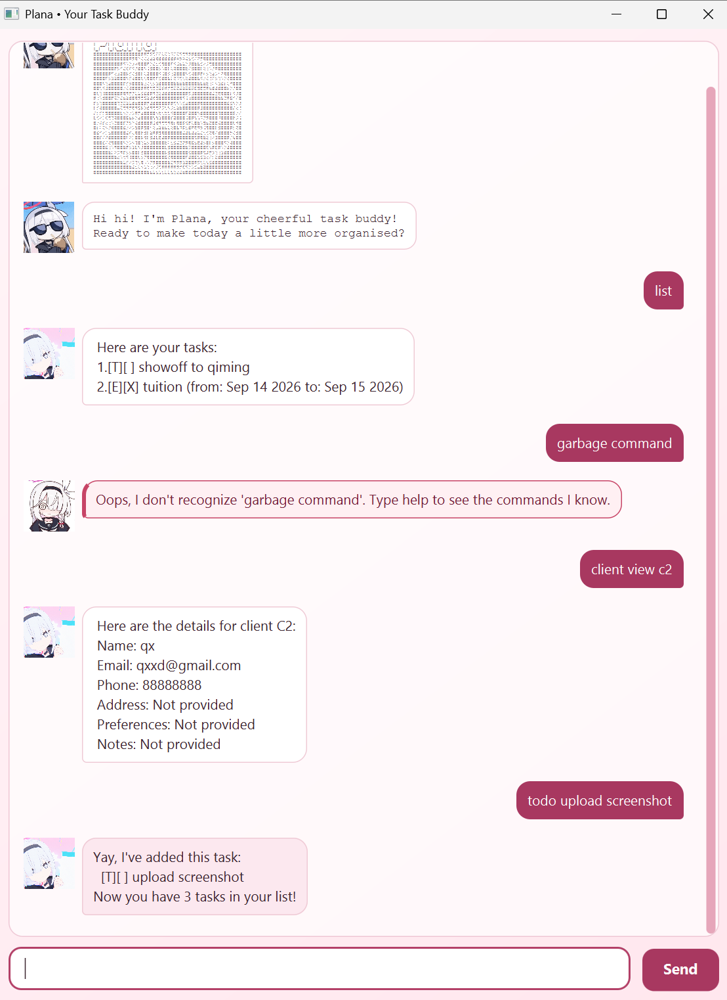

# Plana User Guide

Plana is a friendly desktop application for managing tasks and client records. It is designed for small businesses, such as home bakeries, that want a quick keyboard-driven way to stay organized.



## Quick start

1. Ensure that Java 25 is installed on your computer.
2. Download `plana.jar`.
3. Place the JAR file in the folder where you want Plana to store its data.
4. Open a terminal in that folder.
5. Run:

   ```text
   java -jar plana.jar
   ```

6. Type a command into the command box and press <kbd>Enter</kbd>.

> [!TIP]
> Enter `help` at any time to see the available commands.

## Understanding the command format

Words in angle brackets are values you must provide.

For example:

```text
todo <description>
```

can be used as:

```text
todo buy ingredients
```

Task numbers and client positions refer to their current positions in the displayed list. These positions may change after an item is deleted.

Dates must use the `yyyy-MM-dd` format, such as `2026-09-30`.

## Features

### Viewing help: `help`

Shows the complete list of available commands.

```text
help
```

You can also use:

```text
?
```

### Adding a ToDo: `todo`

Adds a task without a date.

Format:

```text
todo <description>
```

Example:

```text
todo buy cake boxes
```

### Adding a deadline: `deadline`

Adds a task that must be completed by a specified date.

Format:

```text
deadline <description> /by <date>
```

Example:

```text
deadline submit invoice /by 2026-09-30
```

### Adding an event: `event`

Adds an event with a start and end date. The start date must be before the end date.

Format:

```text
event <description> /from <start date> /to <end date>
```

Example:

```text
event wedding cake preparation /from 2026-09-20 /to 2026-09-22
```

### Listing tasks: `list`

Displays all tasks and their current numbers.

```text
list
```

Task status is displayed as:

- `[ ]` — not completed
- `[X]` — completed
- `[T]` — ToDo
- `[D]` — deadline
- `[E]` — event

### Finding tasks: `find`

Finds tasks whose descriptions contain the keyword. The search is case-insensitive.

Format:

```text
find <keyword>
```

Example:

```text
find cake
```

### Viewing tasks on a date: `on`

Displays deadlines due on the specified date and events occurring on that date.

Format:

```text
on <date>
```

Example:

```text
on 2026-09-30
```

### Marking a task as completed: `mark`

Marks a task as completed using its current task number.

Format:

```text
mark <task number>
```

Example:

```text
mark 1
```

### Marking a task as incomplete: `unmark`

Marks a completed task as incomplete.

Format:

```text
unmark <task number>
```

Example:

```text
unmark 1
```

### Deleting a task: `delete`

Permanently deletes a task using its current task number.

Format:

```text
delete <task number>
```

Example:

```text
delete 1
```

> [!WARNING]
> Task numbers may change after a task is deleted. Run `list` again before using another task number.

## Managing clients

Tasks and clients are stored in separate lists.

### Adding a client: `client add`

Adds a client with a required name and email address.

Format:

```text
client add <name> /email <email> [/phone <phone>] [/address <address>] [/preferences <preferences>] [/notes <notes>]
```

Example:

```text
client add Alice Tan /email alice@example.com /phone 91234567 /address 12 Baker Street /preferences less sweet /notes Birthday cake customer
```

The following fields are optional:

- `/phone`
- `/address`
- `/preferences`
- `/notes`

Email addresses are stored in lowercase and must be unique.

### Listing clients: `client list`

Displays all clients and their current position references.

```text
client list
```

References are shown as `C1`, `C2`, and so on.

### Viewing a client: `client view`

Displays all details recorded for a client.

Format:

```text
client view <position>
```

For convenience, all the following forms are accepted:

```text
client view C1
client view c1
client view 1
```

Missing optional information is displayed as `Not provided`.

### Finding clients: `client find`

Searches client names, emails, phone numbers, addresses, preferences, and notes. The search is case-insensitive.

Format:

```text
client find <keyword>
```

Example:

```text
client find nuts
```

### Editing a client: `client edit`

Changes one or more fields belonging to a client.

Format:

```text
client edit <position> /field <value>
```

Example:

```text
client edit C1 /phone 98765432 /preferences no nuts
```

Available field markers are:

- `/name`
- `/email`
- `/phone`
- `/address`
- `/preferences`
- `/notes`

To clear an optional field, enter an empty quoted value:

```text
client edit C1 /notes ""
```

`client edit` currently requires the uppercase reference format, such as `C1`.

### Deleting a client: `client delete`

Permanently deletes a client using its current position reference.

Format:

```text
client delete <position>
```

Example:

```text
client delete C1
```

`client delete` currently requires the uppercase reference format, such as `C1`.

> [!WARNING]
> Client references may change after a client is deleted. Run `client list` again before using another reference.

## Saving data

Plana automatically saves successful changes.

Task data is stored in:

```text
data/plana.txt
```

Client data is stored separately in:

```text
data/clients.txt
```

If either file does not exist when Plana starts, Plana begins with an empty corresponding list and creates the file when data is saved.

Avoid editing these files while Plana is running. Malformed records may be ignored when the application loads.

## Exiting Plana: `bye`

Exits the application.

```text
bye
```

## Command summary

| Action | Command |
|---|---|
| Show help | `help` or `?` |
| Add a ToDo | `todo <description>` |
| Add a deadline | `deadline <description> /by <date>` |
| Add an event | `event <description> /from <start> /to <end>` |
| List tasks | `list` |
| Find tasks | `find <keyword>` |
| View tasks on a date | `on <date>` |
| Complete a task | `mark <task number>` |
| Mark a task incomplete | `unmark <task number>` |
| Delete a task | `delete <task number>` |
| Add a client | `client add <name> /email <email> [optional fields]` |
| List clients | `client list` |
| View a client | `client view <position>` |
| Find clients | `client find <keyword>` |
| Edit a client | `client edit <position> /field <value>` |
| Delete a client | `client delete <position>` |
| Exit Plana | `bye` |